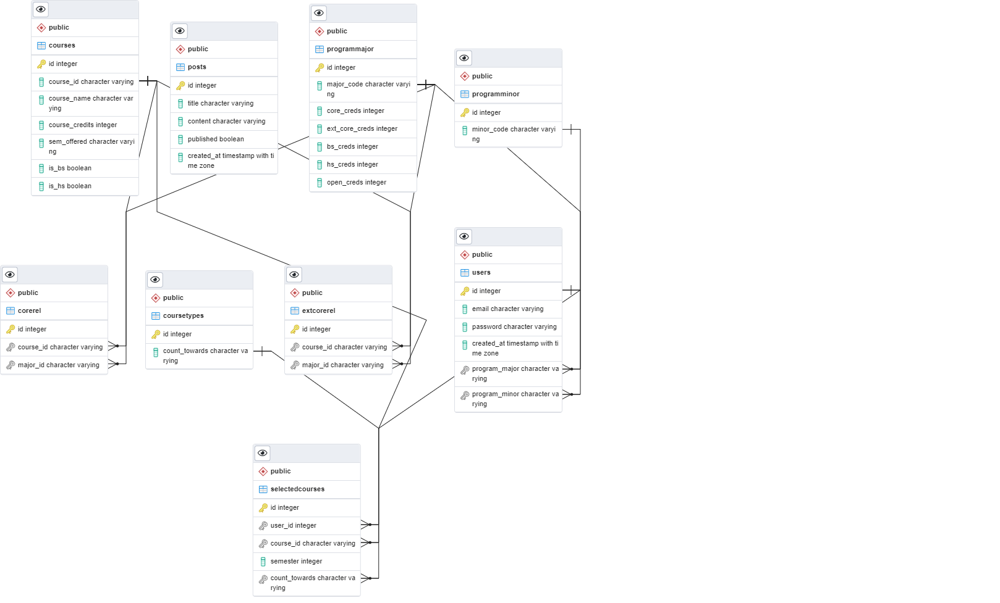

# Graduation Tracker 

## Getting Started
Clone this repo
```
git clone https://gitlab.com/attentive-ai-dev/jarvis/orchestrator-monitoring-ui.git
```

# Client
## How to use

You will need to install dependencies using npm and run it in development. Go to http://localhost:3000/

```
cd client
```

```
npm install
npm start
```

# Server

## How to use

The packages required to run this backend project are listed in ```requirements.txt```.

Run the following command to install them all.
You might want to create a virtual environment and then proceed to install the packages in it.


```
cd server
```

```
pip install virtualenv
virtualenv venv
venv\Scripts\activate
```

```
pip install -r requirements.txt
```

The database used is Postgres. Install postgres and configure the database name, password, database URL etc in the ```main.py``` and ```database.py``` files.

To run the backend, run the following command
```
uvicorn app.main:app --reload
```

---

## API Documentation

Go to the ```/docs``` path for the API documentation. You can also test the API from there itself after authorization (Login) if you dont want to use Postman.

Eg. http://127.0.0.1:8000/docs

---

## Authentication

The authentication used is JWT authorization. The Bearer token has to be sent in the payload of each subsequent request after login for authentication.

---

## Connecting with frontend

Make sure to configure CORS in order to connect to React or any other frontend.

---

## Database Schema



---
